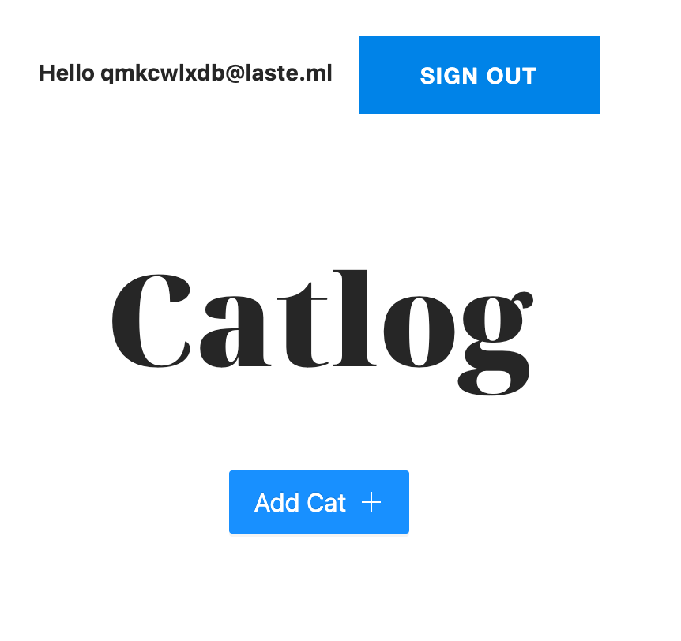

#Catlog

A small application which provides basic functionality to upload an image and a label and a note.
Its backend is built on AWS Lambda, API Gateway, S3, DynamoDB, and State Machine.

## Backend
Backed is based on the AWS Lambda and State Machines:

Upload Image State Machine

Delete Image State Machine

## Frontend
### Authentication
Amplify provides opportunity to leverage AWS Cognito and its UI.

In order to sign up, there is necessity to enter require information

and enter a code which is supposed to be sent on email:

One of users which could be used for testing:

Link: https://dev.d1l2ttnil5ev15.amplifyapp.com/

Username/Email: qmkcwlxdb@laste.ml

Password: q2w3e4r5t6y

After login, there is supposed to be presented the home page:

